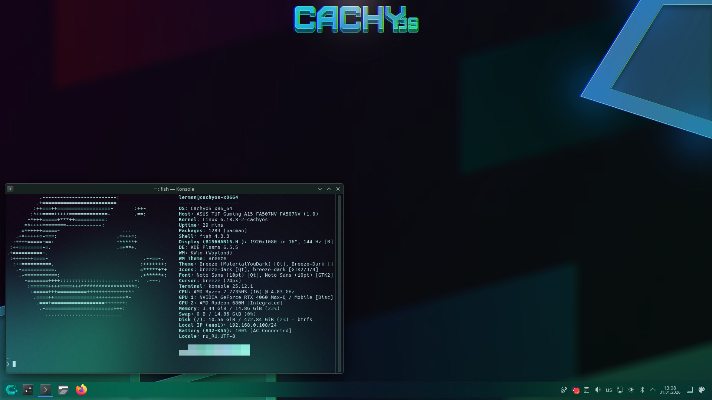

# Lerman

---

**MICROSLOP, YOU'RE STUPID!**

---

<!---
lerman-dev/lerman-dev is a ✨ special ✨ repository because its `README.md` (this file) appears on your GitHub profile.
You can click the Preview link to take a look at your changes.
--->
